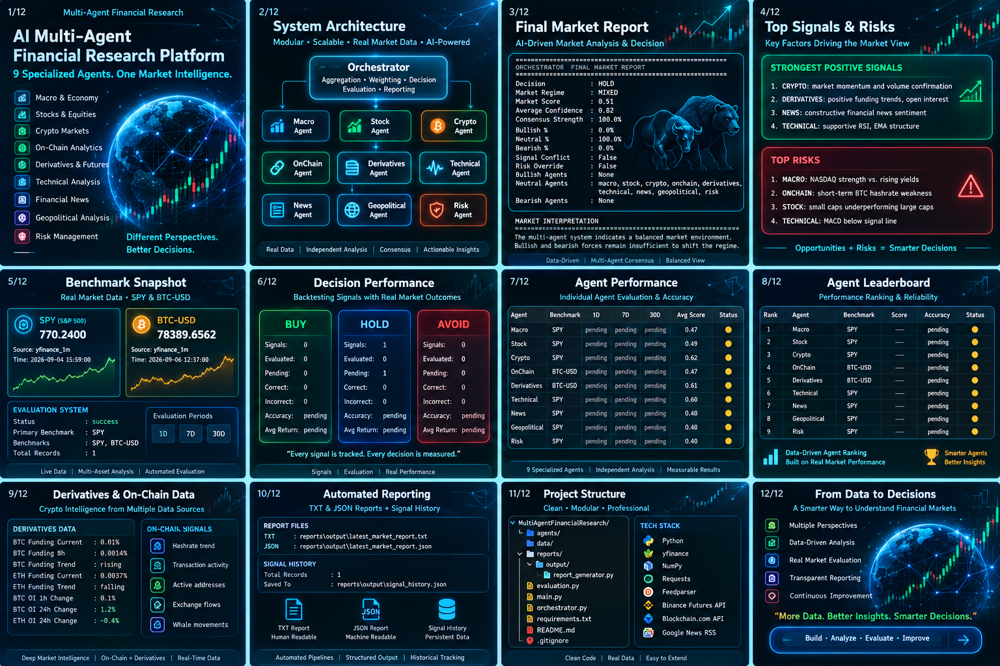

# AI Multi-Agent Financial Research Platform

> **A modular Python-based multi-agent financial intelligence system combining 9 specialized research agents, cross-market data, centralized orchestration, signal persistence, forward benchmark evaluation, and agent-level performance tracking.**

---

## Overview

The **AI Multi-Agent Financial Research Platform** is an experimental financial intelligence and research system built around a modular multi-agent architecture.

Instead of relying on a single analytical model, the platform separates financial research into **9 specialized agents**, each responsible for a distinct market domain:

- Macroeconomics
- Equities
- Cryptocurrency
- On-chain activity
- Crypto derivatives
- Technical analysis
- Financial news
- Geopolitical risk
- Portfolio and market risk

Each agent independently analyzes its domain and produces a structured output containing a **signal, score, confidence level, supporting evidence, and identified risks**.

A central **Orchestrator** then combines these independent assessments into a unified market view.

The platform also records daily signals, captures benchmark prices, evaluates forward performance across multiple time horizons, and tracks the historical performance of individual agents.

---

# System Architecture

```text
                         ┌───────────────────────┐
                         │      ORCHESTRATOR     │
                         │                       │
                         │ Weighted Aggregation  │
                         │ Consensus Analysis    │
                         │ Risk Override         │
                         │ Market Decision       │
                         └───────────┬───────────┘
                                     │
          ┌──────────────────────────┼──────────────────────────┐
          │                          │                          │
          ▼                          ▼                          ▼

     MARKET AGENTS              INTELLIGENCE AGENTS          RISK LAYER

     Macro Agent                News Agent                   Risk Agent
     Stock Agent                Geopolitical Agent
     Crypto Agent
     OnChain Agent
     Derivatives Agent
     Technical Agent

                                     │
                                     ▼

                         ┌───────────────────────┐
                         │    SIGNAL HISTORY     │
                         │ Daily Observations    │
                         │ Benchmark Snapshots   │
                         └───────────┬───────────┘
                                     │
                                     ▼
                         ┌───────────────────────┐
                         │      EVALUATION       │
                         │                       │
                         │ 1D / 7D / 30D         │
                         │ SPY / BTC-USD         │
                         │ Agent Performance     │
                         │ Leaderboard           │
                         └───────────────────────┘
```

---

# Multi-Agent Research Engine

The platform currently contains **9 specialized analytical agents**.

| Agent | Primary Role | Benchmark |
|---|---|---|
| **Macro Agent** | Macro environment, USD, yields, broad equity conditions | SPY |
| **Stock Agent** | Equity market breadth, leadership and relative strength | SPY |
| **Crypto Agent** | BTC, ETH, SOL momentum and crypto market participation | BTC-USD |
| **OnChain Agent** | Bitcoin network activity and blockchain metrics | BTC-USD |
| **Derivatives Agent** | Funding rates, open interest and positioning | BTC-USD |
| **Technical Agent** | RSI, EMA structure, MACD and price momentum | SPY |
| **News Agent** | Financial news sentiment and event concentration | SPY |
| **Geopolitical Agent** | Conflict, sanctions, energy and geopolitical risk | SPY |
| **Risk Agent** | Volatility, correlations and drawdown conditions | SPY |

Every agent returns a structured research result containing:

```text
Signal
Score
Confidence
Evidence
Risks
```

This architecture allows each analytical domain to evolve independently while remaining part of the same decision system.

---

# Central Orchestrator

The **Orchestrator** is the core coordination layer of the platform.

It runs all specialist agents and combines their outputs using weighted aggregation.

The final research output includes:

- Market Decision
- Market Regime
- Market Score
- Average Confidence
- Consensus Strength
- Bullish Agent Distribution
- Neutral Agent Distribution
- Bearish Agent Distribution
- Signal Conflict Detection
- Risk Override
- Strongest Positive Signal
- Strongest Negative Signal
- Top Positive Signals
- Top Risks
- Market Interpretation

Example:

```text
Decision           : HOLD
Market Regime      : MIXED
Market Score       : 0.51
Average Confidence : 0.82
Consensus Strength : 100.0%
```

The goal is not simply to generate a BUY or SELL label.

The system attempts to expose **why** the market assessment was produced and which agents contributed to that conclusion.

---

# Market Intelligence Coverage

## Macro Intelligence

The Macro Agent evaluates conditions including:

- U.S. Dollar Index
- U.S. Treasury yields
- S&P 500
- NASDAQ
- Short-term momentum
- Multi-day market changes
- Yield/equity divergence

---

## Equity Intelligence

The Stock Agent evaluates:

- SPY
- QQQ
- DIA
- IWM
- NVDA
- AAPL
- MSFT
- Large-cap leadership
- Small-cap participation
- Relative market strength
- Short-term and multi-day momentum

---

## Crypto Intelligence

The Crypto Agent analyzes:

- Bitcoin
- Ethereum
- Solana
- 1-day momentum
- 7-day momentum
- Volume confirmation
- BTC/ETH relative strength
- Broad crypto participation

---

## On-Chain Intelligence

The OnChain Agent incorporates Bitcoin network metrics such as:

- Hashrate
- Transaction activity
- BTC price context
- Short-term network changes
- Multi-day blockchain activity

This allows the system to combine traditional market data with blockchain-native information.

---

# Crypto Derivatives Intelligence

The Derivatives Agent analyzes positioning in crypto futures markets.

Current metrics include:

- BTC Funding Rate
- ETH Funding Rate
- Historical Funding Rate
- Funding Trend
- BTC Open Interest
- ETH Open Interest
- 1-hour Open Interest Change
- 24-hour Open Interest Change
- Total Open Interest Notional

The objective is to identify conditions such as:

- Crowded positioning
- Leverage expansion
- Leverage contraction
- Funding pressure
- Changes in derivatives market participation

---

# Technical Analysis Engine

The Technical Agent currently evaluates indicators including:

- RSI
- EMA20
- EMA50
- MACD
- MACD Signal
- MACD Histogram
- 1-day price momentum
- 7-day price momentum

Rather than using a single technical indicator, the agent combines several signals into a unified technical assessment.

---

# Financial News Intelligence

The News Agent processes financial headlines across several categories.

The system evaluates:

- Bullish terminology
- Bearish terminology
- Uncertainty
- Headline concentration
- Severe market events
- Mixed sentiment
- Contextual negation

This provides an additional qualitative intelligence layer alongside quantitative market data.

---

# Geopolitical Risk Intelligence

The Geopolitical Agent analyzes developments involving:

- Military escalation
- Sanctions
- Energy security
- International diplomacy
- Geopolitical uncertainty
- De-escalation
- Event concentration

This layer is designed to capture market risks that may not immediately appear in price-based indicators.

---

# Risk Engine

The Risk Agent monitors market conditions using metrics such as:

- Annualized volatility
- Cross-asset correlation
- Maximum drawdown
- Equity volatility
- Crypto volatility
- Portfolio-level risk concentration

The Orchestrator can use the Risk Agent as a defensive layer when overall conditions deteriorate.

---

# Signal History

The platform contains a persistent signal history system.

Every daily research run records:

- Timestamp
- Date
- Final Decision
- Market Regime
- Market Score
- Average Confidence
- Bullish / Neutral / Bearish distribution
- Consensus Strength
- Risk Override
- Individual Agent Signals
- Individual Agent Scores
- Individual Agent Confidence
- Benchmark Price Snapshots

The system stores **one observation per calendar day**.

If the platform is executed multiple times on the same day, the newest observation replaces the earlier daily record.

This prevents repeated intraday testing from artificially inflating the evaluation dataset.

---

# Multi-Benchmark Evaluation

The platform evaluates signals against real market benchmarks.

Two benchmark families are currently used:

### SPY

Used for:

- Macro
- Stock
- Technical
- News
- Geopolitical
- Risk

### BTC-USD

Used for:

- Crypto
- OnChain
- Derivatives

This prevents crypto-focused agents from being judged against an unrelated equity benchmark.

---

# Walk-Forward Evaluation

Historical signals are evaluated over three forward horizons:

| Horizon | Weight |
|---|---:|
| **1 Day** | 20% |
| **7 Days** | 30% |
| **30 Days** | 50% |

Different movement thresholds are used for equity and crypto benchmarks.

### SPY thresholds

```text
1D  : 0.5%
7D  : 1.5%
30D : 3.0%
```

### BTC-USD thresholds

```text
1D  : 1.0%
7D  : 3.0%
30D : 7.0%
```

A signal remains **PENDING** until enough forward market data exists to evaluate it.

This avoids assigning artificial performance to signals whose evaluation horizon has not yet completed.

---

# Decision Performance Tracking

The platform independently tracks the performance of final Orchestrator decisions:

```text
BUY
HOLD
AVOID
```

For each horizon, the evaluation engine records:

- Total Signals
- Evaluated Signals
- Pending Signals
- Correct Decisions
- Incorrect Decisions
- Accuracy
- Average Benchmark Return

This provides a foundation for measuring whether the final multi-agent decision improves over time.

---

# Agent-Level Performance Evaluation

The system does not evaluate only the final decision.

Every individual agent is evaluated independently.

For each agent and time horizon, the platform tracks:

- Total Signals
- Evaluated Signals
- Pending Signals
- Correct Signals
- Incorrect Signals
- Accuracy
- Average Score
- Average Confidence
- Benchmark Return
- Bullish Signals
- Neutral Signals
- Bearish Signals

This makes it possible to identify which analytical domains are actually contributing useful predictive information.

---

# Agent Leaderboard

The evaluation engine automatically builds an **Agent Leaderboard** from realized historical performance.

Leaderboard metrics include:

- Rank
- Benchmark
- Status
- Evaluated Samples
- Correct Predictions
- Incorrect Predictions
- Raw Accuracy
- Weighted Accuracy
- Leaderboard Score
- 1D Accuracy
- 7D Accuracy
- 30D Accuracy

Longer-horizon results receive greater weight:

```text
1D  = 20%
7D  = 30%
30D = 50%
```

Agent status progresses through:

```text
PENDING
PROVISIONAL
RELIABLE
```

The leaderboard is intentionally inactive when there is insufficient forward performance data.

The objective is to rank agents using **observed results rather than assumed quality**.

---

# Automated Reporting

Every research run automatically generates human-readable and machine-readable reports.

```text
reports/output/latest_market_report.txt
reports/output/latest_market_report.json
reports/output/signal_history.json
reports/output/evaluation_results.json
```

Reports contain information including:

- Executive Summary
- Market Interpretation
- Consensus Analysis
- Agent Distribution
- Strongest Signals
- Top Positive Signals
- Top Risks
- Individual Agent Results
- Detailed Agent Analysis
- Benchmark Performance
- Decision Performance
- Agent Performance
- Agent Leaderboard

The JSON outputs also make the architecture suitable for future dashboards, APIs, alerts, or external applications.

---

# Project Structure

```text
MultiAgentFinancialResearch
│
├── agents
│   ├── macro_agent.py
│   ├── stock_agent.py
│   ├── crypto_agent.py
│   ├── onchain_agent.py
│   ├── derivatives_agent.py
│   ├── technical_agent.py
│   ├── news_agent.py
│   ├── geopolitical_agent.py
│   └── risk_agent.py
│
├── data
│   ├── macro_data.py
│   ├── stock_data.py
│   ├── crypto_data.py
│   ├── onchain_data.py
│   ├── derivatives_data.py
│   ├── technical_data.py
│   ├── news_data.py
│   ├── geopolitical_data.py
│   └── risk_data.py
│
├── reports
│   ├── output
│   │   ├── latest_market_report.txt
│   │   ├── latest_market_report.json
│   │   ├── signal_history.json
│   │   └── evaluation_results.json
│   │
│   └── report_generator.py
│
├── screenshots
│
├── evaluation.py
├── signal_history.py
├── orchestrator.py
├── main.py
├── requirements.txt
└── README.md
```

---

# Platform Screenshots

## 1. Multi-Agent Architecture

The platform is divided into independent research agents and data modules coordinated through a central Orchestrator.


---

## 2. Orchestrator Market Report

The Orchestrator combines all specialist assessments into a unified market decision, regime, confidence and consensus analysis.


---

## 3. Positive Signals and Market Risks

The platform extracts the strongest supporting signals and the most important risks detected across the agent network.


---

## 4. Benchmark Snapshot and Forward Evaluation

SPY and BTC-USD snapshots are stored alongside each signal for future performance measurement.


---

## 5. Decision Performance

Final BUY, HOLD and AVOID decisions are evaluated separately across 1D, 7D and 30D horizons.


---

## 6. Agent Performance

Every specialist agent receives independent performance statistics against its assigned benchmark.


---

## 7. Agent Leaderboard

The leaderboard ranks specialist agents using realized, horizon-weighted performance once sufficient forward evaluation data becomes available.


---

## 8. Derivatives Intelligence and Final Agent Check

The final research output includes agent-level validation and detailed crypto derivatives metrics such as funding and open interest.


---

# Data Sources

The current platform uses data from sources including:

- Yahoo Finance / yfinance
- Binance Futures
- Blockchain.com
- Google News RSS

The architecture is modular, allowing additional providers and alternative datasets to be integrated later.

---

# Technology Stack

### Language

```text
Python
```

### Core Libraries

```text
yfinance
NumPy
Requests
Feedparser
```

### External Data

```text
Binance Futures
Blockchain.com
Google News RSS
Yahoo Finance
```

### Architecture

```text
Multi-Agent Research System
Modular Data Layer
Central Orchestrator
Signal Persistence
Multi-Benchmark Evaluation
Agent Performance Tracking
Automated Reporting
```

---

# Development Roadmap

The current platform establishes the core research and evaluation infrastructure.

Future development may include:

- Larger real-world signal history
- Adaptive agent weighting based on observed performance
- Confidence calibration
- Additional asset-class benchmarks
- Portfolio construction
- Position sizing
- Strategy-level backtesting
- Risk-adjusted performance metrics
- Automated market alerts
- Interactive dashboard
- Database-backed historical storage
- API layer
- LLM-assisted research synthesis
- Additional on-chain datasets
- Advanced derivatives analytics

### Adaptive Agent Weighting

A future version may allow historically stronger agents to receive greater influence in the Orchestrator.

This feature is intentionally **not activated yet**.

Adaptive weights should only be introduced after sufficient real forward-evaluation data has accumulated.

This avoids optimizing the system against an insufficient sample.

---

# Research Philosophy

The project is built around four principles:

**Specialization**  
Different market domains should be analyzed independently by specialized components.

**Transparency**  
The final decision should expose the underlying signals, confidence, risks and agent contributions.

**Evaluation**  
Agent quality should be measured using forward market outcomes rather than assumed from model complexity.

**Modularity**  
Agents, datasets, benchmarks and evaluation methods should be replaceable without rebuilding the entire platform.

---

# Current Status

```text
Multi-Agent Engine       : ACTIVE
Specialized Agents       : 9
Central Orchestrator     : ACTIVE
Signal History           : ACTIVE
SPY Benchmark            : ACTIVE
BTC-USD Benchmark        : ACTIVE
1D Evaluation            : ACTIVE
7D Evaluation            : ACTIVE
30D Evaluation           : ACTIVE
Agent Performance        : ACTIVE
Agent Leaderboard        : ACTIVE
Automated Reporting      : ACTIVE
Adaptive Agent Weights   : FUTURE
```

The platform is currently in the **live signal collection and forward-evaluation phase**.

Performance statistics remain pending until sufficient forward benchmark data has accumulated.

---

# Installation

Clone the repository and create a Python virtual environment.

```bash
python -m venv .venv
```

### Windows

```bash
.venv\Scripts\activate
```

Install the required dependencies:

```bash
pip install -r requirements.txt
```

Run the platform:

```bash
python main.py
```

Each run executes the specialist agents, generates the Orchestrator market assessment, updates the daily signal history, evaluates eligible historical signals and generates the latest reports.

---

# Disclaimer

This project is designed for **research, education and experimental financial analysis**.

It does not constitute financial, investment or trading advice.

Market signals and historical evaluation do not guarantee future performance.

---

# Author

**Tamás Németh**

Independent project focused on:

**Artificial Intelligence • Multi-Agent Systems • Financial Research • Crypto Market Intelligence • Python • Quantitative Analysis**
